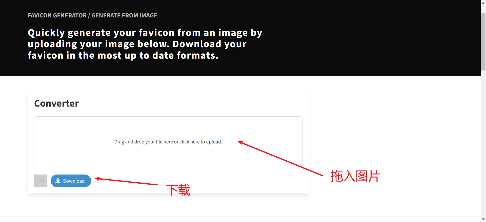
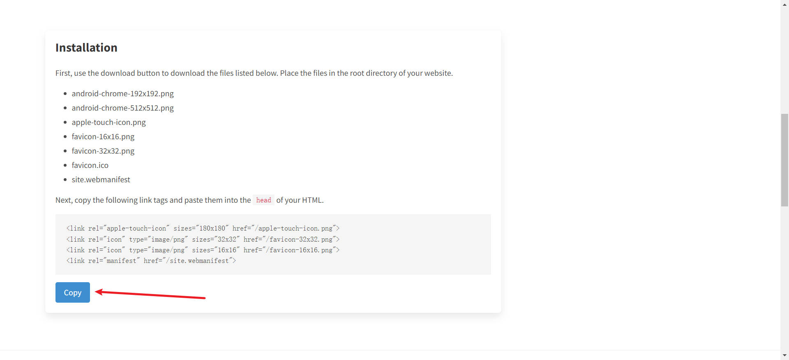

# 1、网站图标
更改您的网站图标Icon.

1. 进入[favicon.io](https://favicon.io/favicon-converter/)，将icon文件拖进去，点击Download

2. 将Download的文件解压,鼠标下滑点击 Cpoy，将其粘贴在 `index.html` 中
   

> [!NOTE]
> - icon.png推荐: [阿里巴巴矢量图标库](https://www.iconfont.cn/)
> - png转icon推荐：[比特虫](https://www.bitbug.net/)
