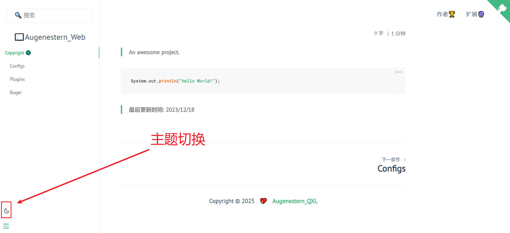

# 1、Docsify主题切换
- 插件[docsify darklight theme](https://docsify-darklight-theme.boopathikumar.me/#/)

## 1.1、配置

```html
<!--主题切换css文件-->
<link rel="stylesheet" href="//cdn.jsdelivr.net/npm/docsify-darklight-theme@latest/dist/style.min.css" />
<!--主题切换js文件-->
<script src="//cdn.jsdelivr.net/npm/docsify-darklight-theme@latest/dist/index.min.js"</script>

```

> [!WARNING]
> 这个插件的默认按钮位置和我们的字数统计显示重叠了,所以需要改动源码来控制其位置.
> 
> 这里我是参考了一位大佬的改动代码地址: [docsify 折腾记](https://foreti.me/blog/2021/05/09/docsify-build/)

## 1.2、自定义配置
这里我借用网上搜寻的一位朋友的代码,改动的js为`theme.js`代码如下:
```javascript
window.$docsify.plugins = [].concat((e, o) => {
  let t = {
    siteFont: "PT Sans",
    defaultTheme: "dark",
    codeFontFamily: "Roboto Mono, Monaco, courier, monospace",
    bodyFontSize: "17px",
    dark: {
      accent: "#42b983",
      toogleBackground: "#ffffff",
      background: "#091a28",
      textColor: "#b4b4b4",
      codeTextColor: "#ffffff",
      codeBackgroundColor: "#0e2233",
      borderColor: "#0d2538",
      blockQuoteColor: "#858585",
      highlightColor: "#d22778",
      sidebarSublink: "#b4b4b4",
      codeTypeColor: "#ffffff",
      coverBackground: "linear-gradient(to left bottom, hsl(118, 100%, 85%) 0%,hsl(181, 100%, 85%) 100%)",
      toogleImage: "url(https://cdn.jsdelivr.net/npm/docsify-darklight-theme@latest/icons/sun.svg)"
    },
    light: {
      accent: "#42b983",
      toogleBackground: "#091a28",
      background: "#ffffff",
      textColor: "#34495e",
      codeTextColor: "#525252",
      codeBackgroundColor: "#f8f8f8",
      borderColor: "rgba(0, 0, 0, 0.07)",
      blockQuoteColor: "#858585",
      highlightColor: "#d22778",
      sidebarSublink: "#505d6b",
      codeTypeColor: "#091a28",
      coverBackground: "linear-gradient(to left bottom, hsl(118, 100%, 85%) 0%,hsl(181, 100%, 85%) 100%)",
      toogleImage: "url(https://cdn.jsdelivr.net/npm/docsify-darklight-theme@latest/icons/moon.svg)"
    }
  };
  if (o.config.hasOwnProperty("darklightTheme")) {
    for (var [r, l] of Object.entries(o.config.darklightTheme)) "light" !== r && "dark" !== r && "defaultTheme" !== r && (t[r] = l);
    for (var [r, l] of Object.entries(t)) "light" !== r && "dark" !== r && (t[r] = l, document.documentElement.style.setProperty("--" + r, l));
    if (o.config.darklightTheme.hasOwnProperty("dark"))
      for (var [r, l] of Object.entries(o.config.darklightTheme.dark)) t.dark[r] = l;
    if (o.config.darklightTheme.hasOwnProperty("light"))
      for (var [r, l] of Object.entries(o.config.darklightTheme.light)) t.light[r] = l
  } else
    for (var [r, l] of Object.entries(t)) "light" !== r && "dark" !== r && (t[r] = l, document.documentElement.style.setProperty("--" + r, l));
  window.matchMedia("(prefers-color-scheme: dark)").matches ? t.defaultTheme = "dark" : window.matchMedia("(prefers-color-scheme: light)").matches && (t.defaultTheme = "light");
  var d = e => {
    if (localStorage.setItem("DARK_LIGHT_THEME", e), t.defaultTheme = e, "light" == e)
      for (var [o, r] of Object.entries(t.light)) document.documentElement.style.setProperty("--" + o, r);
    else if ("dark" == e)
      for (var [o, r] of Object.entries(t.dark)) document.documentElement.style.setProperty("--" + o, r);
    document.documentElement.style.setProperty("color-scheme", e)
  };
  e.afterEach((function (e, o) {
    if (document.getElementById('docsify-darklight-theme') == null) {
      o(e = '<div id="docsify-darklight-theme"><p>.</p></div>' + e)
    } else {
      o(e)
    }
  })), e.doneEach((function () {
    let e = localStorage.getItem("DARK_LIGHT_THEME");
    "light" == e || "dark" == e ? (t.defaultTheme = e, d(t.defaultTheme)) : d(t.defaultTheme);
    const o = document.getElementById("docsify-darklight-theme");
    null !== o && o.addEventListener("click", (function () {
      "light" === t.defaultTheme ? d("dark") : d("light")
    }))
  }))
}, window.$docsify.plugins);
```

移除远程引用，添加本地引用：
```html
<script src="theme.js"></script>
```
同时在`index.html`添加一段Script:
```html
<script>
    function move() {
      document.getElementsByClassName('sidebar')[0].setAttribute('id', 'sidebar-full')
      document.getElementById('sidebar-full').appendChild(document.getElementById('docsify-darklight-theme'))
      var button = document.getElementById('docsify-darklight-theme')
      button.style.position = 'fixed'
      button.style.left = '10px'
      button.style.bottom = '58px'
      button.style.top = 'auto'
      button.style.width = '18px'
      button.style.height = '18px'
    }
    var refreshId = setInterval(function () {
      if (null != document.getElementById('docsify-darklight-theme')) {
        move();
        clearInterval(refreshId);
      }
    }, 100);
</script>
```
如果觉得侧边栏问题太挤,可以再调整下样式:
```html
<style>
.sidebar-nav ul li {
    margin-left: 25px;
}

.sidebar-nav {
    line-height: 1.5em !important;
    padding-bottom: 76px;
}
</style>
```

## 1.3、最终结果



> [!WARNING]
> 我没集成这个插件,因为集成后发现影响右侧目录和字数统计会重叠,于是取消集成..