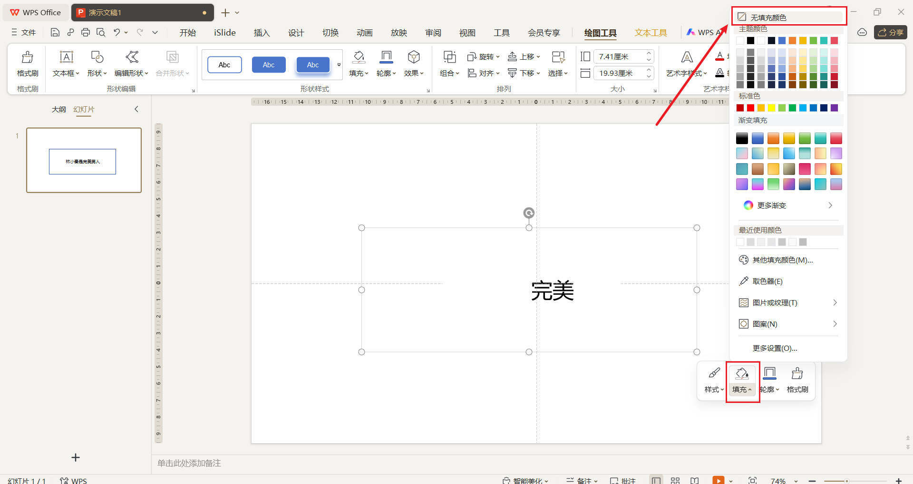
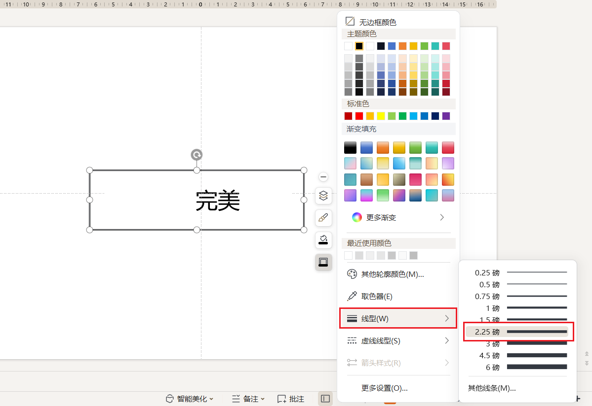
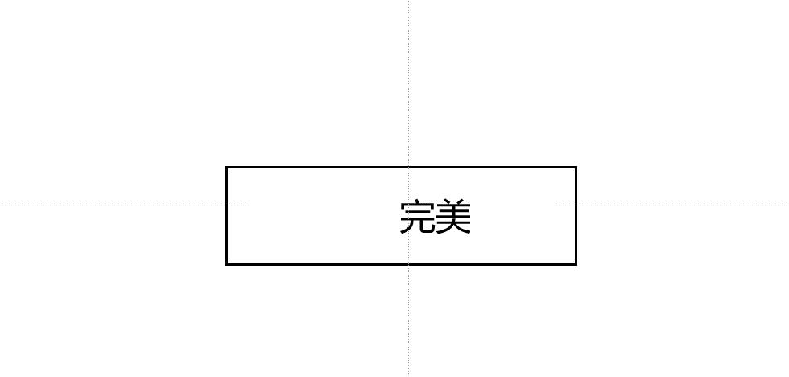
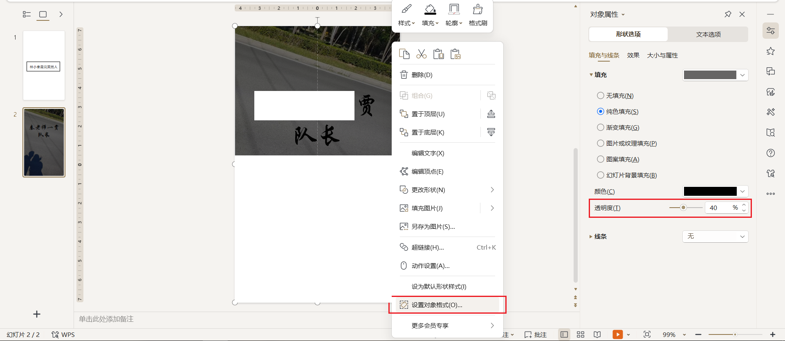
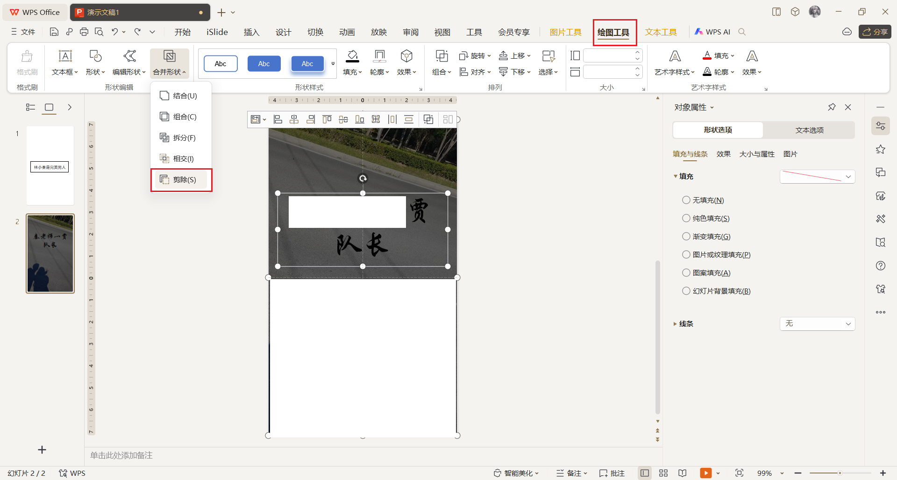
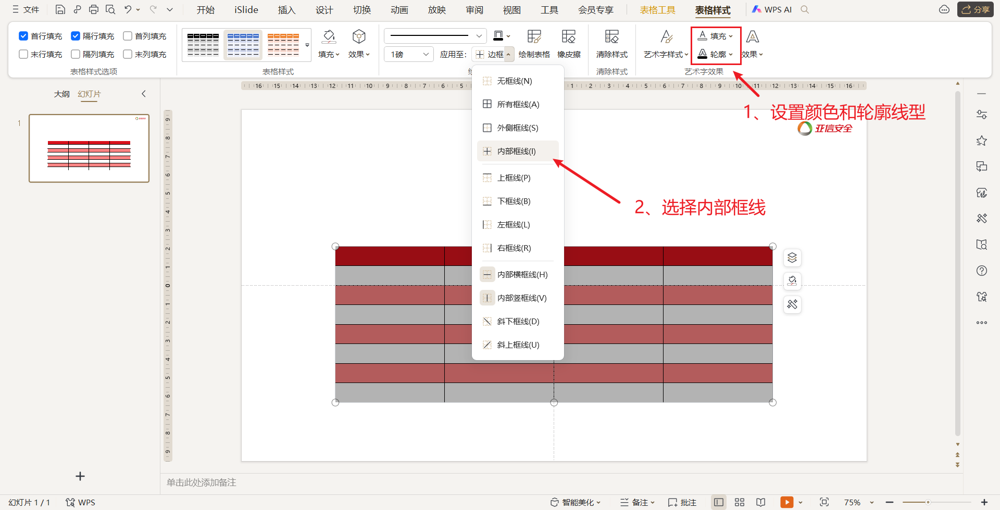

# 背景

- [x] 在这个丑陋的世界上，你的PPT只要稍微好看一些，就仿佛是开了外挂。

> 1. 为什么好的PPT字要少?

- 因为观众喜欢做判断题和选择题，而不喜欢做**阅读题**

> 2. 为什么好的PPT逻辑要清晰？

- 因为观众容易**走神**

> 3. 为什么好的PPT要设计的漂亮？

- 因为观众有**美学**需求

> PPT做的好的人，一定是站在**观众**的视角

# 提高审美

- [x] 每天多看十分钟

- [站酷ZCOOL-设计师互动平台-打开站酷，发现更好的设计！](https://www.zcool.com.cn/)
- [花瓣网 - 陪你做生活的设计师（创意灵感天堂，搜索、发现设计灵感、设计素材） (huaban.com)](https://huaban.com/)

# 快捷键

- `Ctrl + M` ： 快速新建幻灯片
- `Ctrl + ]` : 快速放大字体
- `Ctrl + [` : 快速缩小字体
- `Ctrl + shift` ： 中心等比例放大

# Tips

- [x] 字体嵌入

> 在自己电脑上的保存的PPT里面的文字在其他人电脑上就没法显示了，字体丢失！
>
> - [ ] 解决办法：文件 - 选项 - 常规保存 - 勾选将字体嵌入文件

# 1、插入图形

> 如何使得插入的图形更好看

1. 右键点击图形 - 轮廓 - 设置线型大小和粗细

# 2、插入图片

> 压缩图片，缩小PPT体积

1. 点击图片
2. 在右上方 - 图片工具 - 压缩图片

> 使图片平铺PPT

1. 点击图片 - 左上角裁剪 - 按比例裁剪
2. 这样裁剪出来的图片放大就可以平铺屏幕

# 3、字体

- [x] 商务报告：年终总结、会议室、办公室、打工人

> **黑体**：黑体非常适合商务场景使用的字体，黑体类型非常耐看
>
> - 微软雅黑
> - 思源黑体
> - 黑体

- [x] 广告宣传：

> **装饰体**：装饰体可以起到很好的夺人眼球的效果
>
> - 方正粗谭黑简体
> - 造字工房版黑
> - 方正综艺简体

- [x] 教学课件

> 卡通/手写/装饰
>
> 小学以下：
>
> - 方正喵呜体
> - 方正少儿体
> - 方正卡通简体
> - 华康少女文字
> - 华康娃娃体
>
> 中学：
>
> - 方正风雅宋
> - 仿宋
> - 楷体

## 3.1、给文字加外边框

1. 插入 - 形状 - 矩形，框选文本 - 填充 - 选择 ==无填充颜色==

2. 边框选择颜色 ，将线型加大

3. 队长，是不是`Perfect！`

## 3.2、图文结合

1. 插入图片，让图片平铺幻灯片
2. 插入文字 - 居中 - 设置字体和大小

## 3.3、镂空字

1. 插入图形 - 矩形 - 将图片铺满 - 填充黑色 - 设置为无边框
2. 右键设置对象格式 - 调整透明度

3. 先点击透明框，再按住`shift`键，鼠标框选文本框，在绘图工具里面选择剪除

> 这里我WPS剪除后全部都剪没了，所以没再实验，权当了解

## 3.4、字体强调

- 文字较多时，将重点文字加粗变红
- 或者直接将重点文字变为较粗的字体 - 思源黑体等等

# 4、形状

## 4.1、用形状来表达流程

## 4.2、用形状来衬托文字

> 宗旨：**给文字加深色半透明的框**

## 4.3、分割内容区域

# 5、版面

- 版面干净：脱掉肮脏效果 - 保持扁平化 - 保持纯色 - 去除立体 - 去除阴影
- **PPT主题色不超过4种**

# 6、表格

1. 插入 - 表格 - 选择列数和行数
2. 可以对表格的底纹进行修改

## 6.1、表格模板

1. **标题行主题色**
   - 选中表格的第一行标题行，表格样式 - 填充 - 取色器

2. **内容行双色交替**
   - 例如一行白色、一行红色、一行白色、一行红色
   - 将第三行表格填充为红色 -  右键第三行表格 - 设置对象格式 - 颜色 - 更多颜色

3. **内框先虚化、外框线加粗**
   - 选中所有单元格，表格样式里面设置颜色和轮廓的线型，接着点击边框 - 内部框线
   - 一半内框线颜色为浅灰色、线型为0.5磅

- 接着设置外边框的线型为2.5磅，选择边框 - 外侧框线

> 表格里面的字体一般为**微软雅黑、白色**

# 7、柱形图和条形图

1. 三角柱形图
   - 插入一个三角形，轮廓 - 无边框颜色
   - `ctrl+c` 复制三角形
   - 点击柱形图随便一根柱子，填充 - 图片或纹理填充 - 图片填充 - 剪切板

# 踩坑记录

## 一键删除PPT页面的所有动画

1. 方法一：选中当前页面，点击工具栏动画，选择"动画窗格"，进入动画窗格的对话框

> 这种方法需要一页一页删

2. 方法二：单击选择工具栏"幻灯片放映"，进入下拉选项后，选择"设置幻灯片放映"按钮，勾选"放映不加动画"

## 一键取消PPT页面的切换效果

1. 首先`Ctrl+A`全选所有幻灯片，点击切换 - 无切换

## 一键禁止PPT自动放映

1. 点击放映 - 放映设置 - 换片方式换为**手动**

## 一键重命名母版视图名称

视图 - 幻灯片母版

## 一键更改PPT的只读模式

1. 右键PPT - 属性 - 取消勾选只读

