# 1、微PE工具箱

- 官方下载地址：https://www.wepe.com.cn/download.html

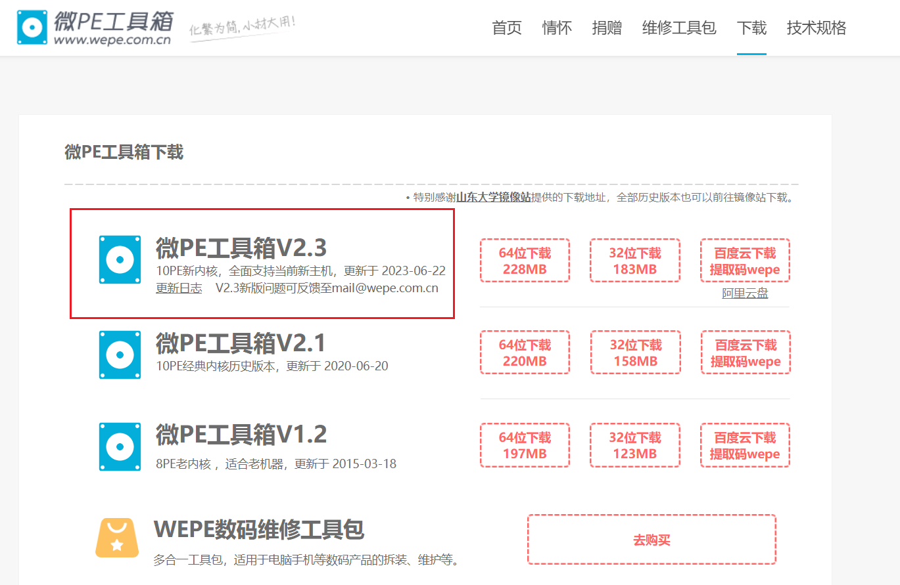

- 下载完成后打开

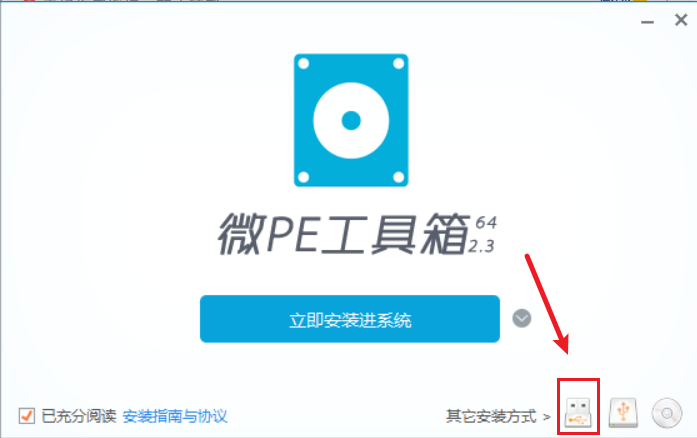

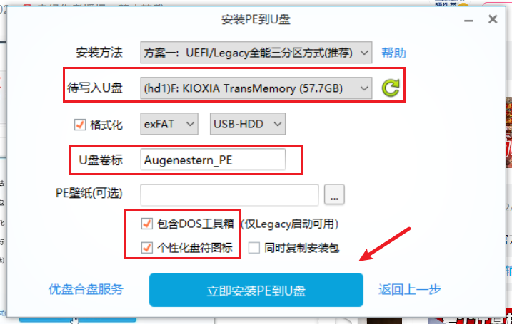

- 等待安装完成

- 安装完成会出现两个盘，EFI 盘不要动

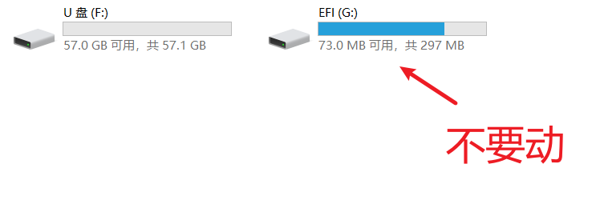

# 2、镜像下载

- 方法一：windows10微软官方网站下载：https://www.microsoft.com/zh-cn/software-download/windows10

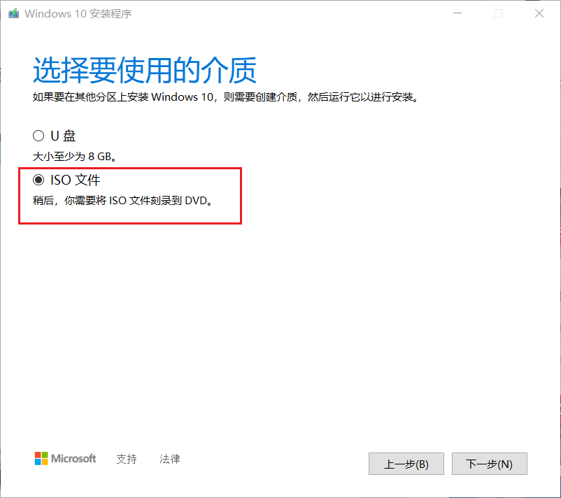

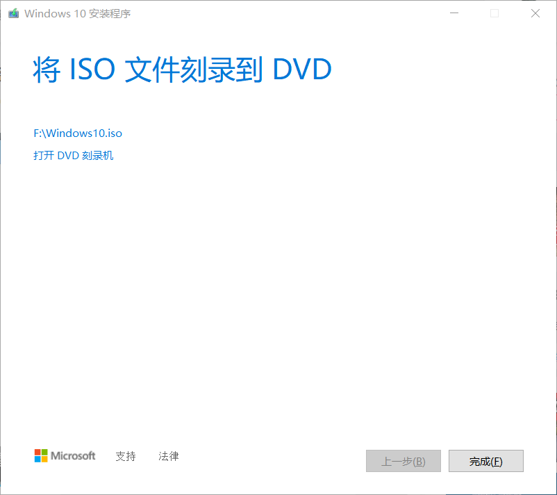

- 方法二：纯净镜像网站：[https://next.itellyou.cn](https://next.itellyou.cn/Original/Index)
  - 下载iso完成后，可以进入：https://share.weiyun.com/m4VMLcNb 下载`iHasher` 检测下载的文件是否完好无损。

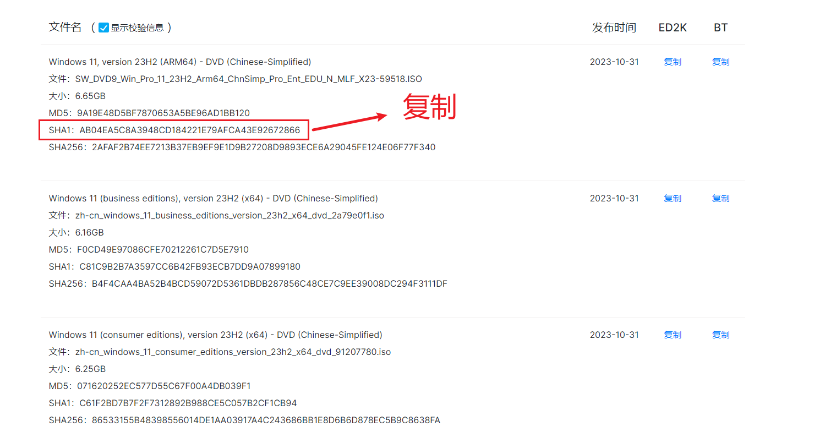

- 将下载好的iso拖进来，与上图的SHA1进行校验

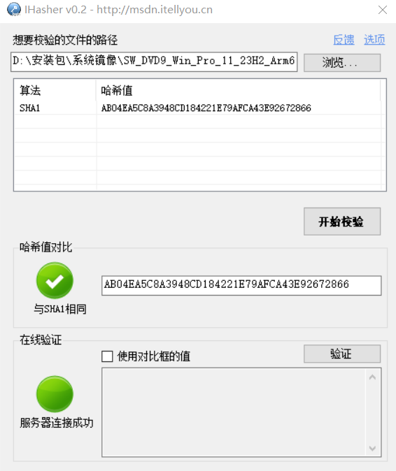

- 如上图，正确无误则表示成功

# 3、开始

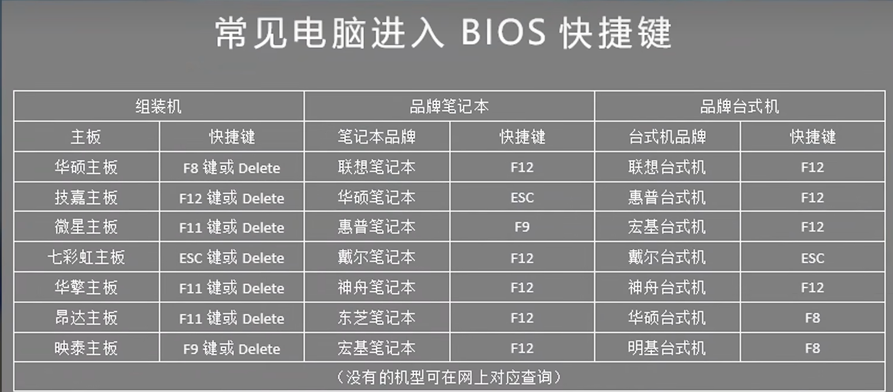

- 进入BIOS，将 `UEFI` 设置为第一启动项

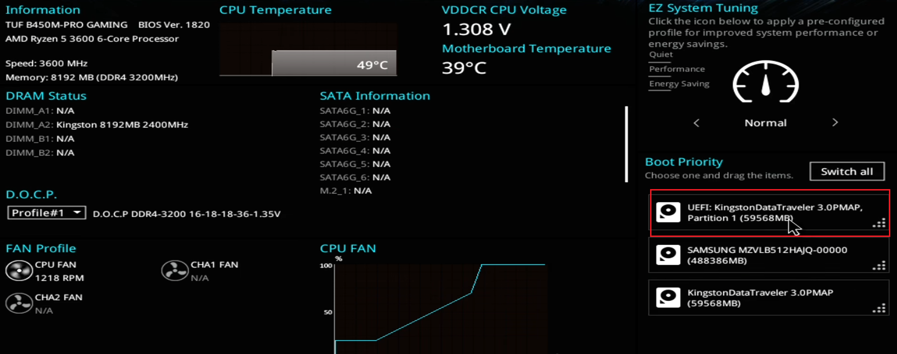

- 自动进入微PE的桌面，打开分区精灵
- 观察分区表的类型：
  - 如果是UEFI启动的类型，则分区表类型需要为 `GPT`

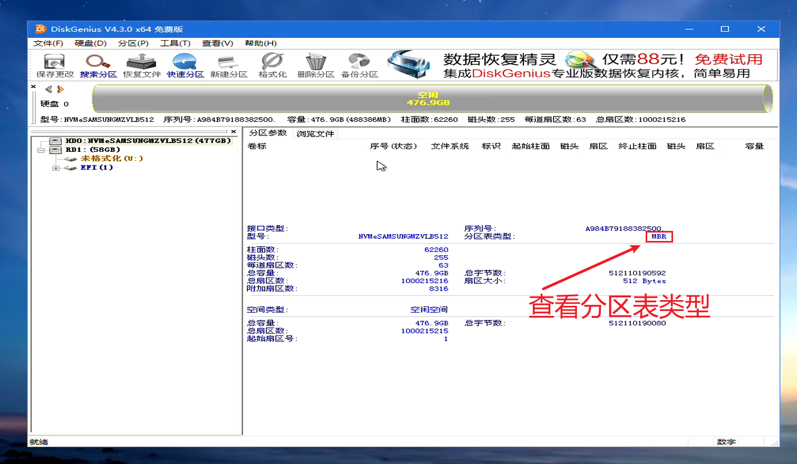

- 这里不匹配，则右键需要安装的磁盘大标题 - 转换分区表类型为 GUID 格式

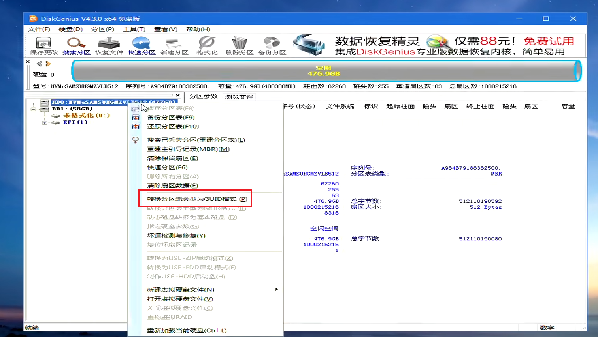

- 转换好后 - 右键 - 进行分区

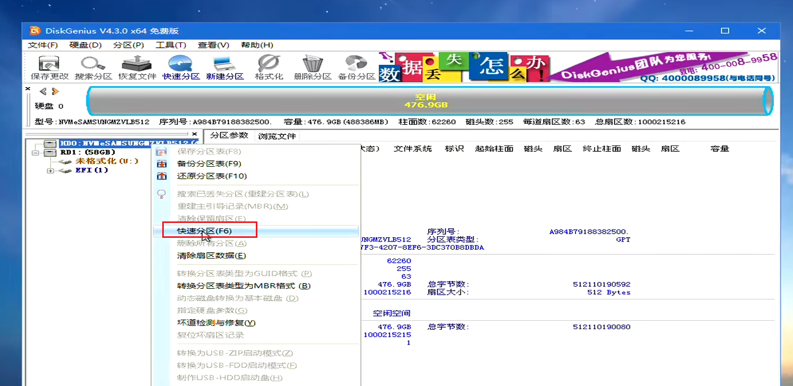

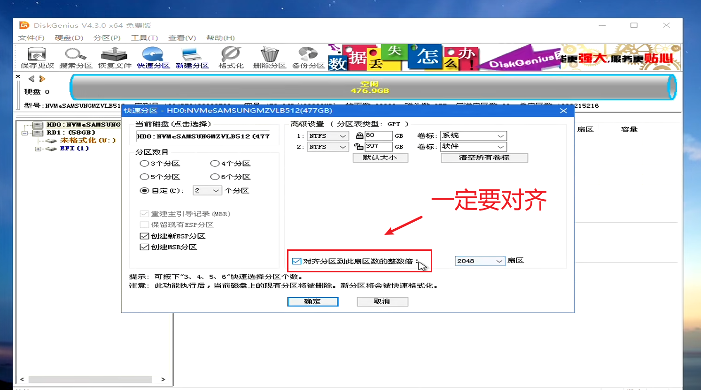

- 分好区后，打开此电脑 - 找到U盘的Windows10安装包 - 右键 - 装载

